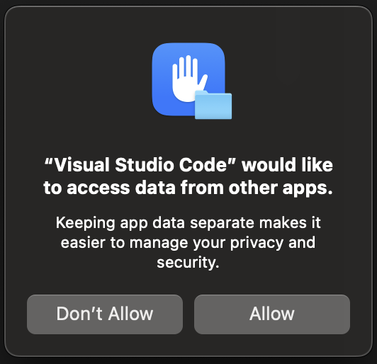

<p align="center">
  
</p>

<p align="center" style="font-size:26px">
  Introduction to Coding With AI - Container Exercise
<p align="center">

## Overview

**What you'll build:** two containers — a static information page, then a Node.js single-page app.

By the end you will be able to write a Dockerfile from scratch, build an image, run it, reach it from your browser, read its logs, and shell into it.

## Before you start

Open a terminal and run:

```
docker --version
docker run --rm hello-world
```

You should see a version number, then a short "Hello from Docker!" message.

**If that fails,** let us know now!

Check that you have the following two folders:

```
docker-lab/
├── exercise-1/
│   └── site/         ← index.html and styles.css
└── exercise-2/
    ├── package.json
    ├── server.js
    └── public/       ← the SPA itself
```
<br/><br/>
# Knowledge Base
## Core Concepts

- **Dockerfile** — A plain text file containing step-by-step instructions for building an image.
- **Image** — A read-only, layered snapshot or blueprint created from a Dockerfile. Images are immutable.
- **Container** — A live running instance of an image.

In these exercises you will iterate through this process:

```
edit Dockerfile  →  docker build  →  docker run  →  check browser
```

## Dockerfile
Key Components
- **Base Image** - The starting point that the image will extend.
- **Working Directory** - The path where image files will be copied and commands executed.
- **Application Code & Dependencies** - Anything that is required for the application to run.
- **Commands & Configurations** - Instructions to execute commands, set environment variables, and expose ports.

<br/>

Common "Gotchas"
- **COPY sees only the build context** - The folder you hand to docker build. It cannot reach anything outside it — no ../ escapes.
- **RUN vs CMD** - RUN executes while the image is being built and its result is baked in. CMD is the process that starts when a container runs.

<br/>

Best Practices
- **Separate Concerns** - Each container should only have one concern (or thing that it does/looks after). Decouple apps into multiple containers.
- **Exclude** - Use a .dockerignore file to list files that should not be packaged.
- **Base Images** - Use Chainguard base images.
- **Dependencies** - Only package the necessary dependencies (i.e. don’t install dev dependencies)
- **Permissions** - The container should be configured to run as a non-root user. Don’t install or run commands using sudo.

<br/>

# Exercise 1 — Containerise a static HTML page

**Goal:** serve `site/index.html` from inside a container using nginx.

### Step 1. Inspect and understand what you're containerising

```
cd docker-lab/exercise-1
ls -R
```

There is no application here only HTML and CSS. Something still has to *serve* those files over HTTP, and that something will be nginx, which we get for free as a base image.

### Step 2. Create the Dockerfile

Create a file called exactly `Dockerfile` (no extension) in `exercise-1/`, next to the `site/` folder.

Write these three instructions:

```dockerfile
FROM nginx:1.27-alpine

COPY site/ /usr/share/nginx/html/

EXPOSE 80
```

What each line does:

- **`FROM`** — every Dockerfile starts here. It names the base image you're building on top of. `nginx:1.27-alpine` is the official nginx image built on Alpine Linux, which keeps it around 50 MB instead of 190 MB.
- **`COPY`** — copies from your machine (the *build context*) into the image. `/usr/share/nginx/html/` is where this image's nginx looks for files by default.
- **`EXPOSE`** — documentation only. It records which port the app listens on. It does **not** open anything; that happens at run time.

There is no `CMD` because the nginx base image already defines one.

> **Why pin `1.27` and not use `latest`?** `latest` moves. A build that worked on Tuesday can break on Wednesday. Pin your base images.

### Step 3. Build the image

Open a terminal and from inside `exercise-1/` run:

```
docker build -t lab-site:1.0 .
```

- `-t lab-site:1.0` tags the image with a name and version so you can refer to it later.
- The trailing `.` is **not** decoration — it is the build context, the folder sent to the builder. Forgetting it is the single most common error in this lab.

**If you are using VSCode, you will likely get the following prompt. Click "Allow".**
<p align="center">
  
</p>


Watch the output. Each instruction produces a numbered step.

Once the build finishes, confirm the newly created image exists:

```
docker image ls lab-site
```

### Step 4. Run it

```
docker run --rm -p 8080:80 --name my-site lab-site:1.0
```

Breaking that down:

- `--rm` — delete the container when it stops, so you don't accumulate dead containers.
- `-p 8080:80` — **`hostPort:containerPort`**. Traffic to port 8080 on your laptop is forwarded to port 80 inside the container. These two numbers are independent; 8080 is simply a port that's usually free.
- `--name my-site` — a friendly name instead of a random one.

Open **http://localhost:8080**.

Your terminal is now attached to nginx's logs. Reload the page and watch the access log lines appear. Press `Ctrl+C` to stop the container.

### Step 5. Prove the port mapping is arbitrary

```
docker run --rm -p 9999:80 --name my-site lab-site:1.0
```

Now the same image is at **http://localhost:9999**. Nothing inside the container changed. Port 9999 does not appear anywhere in your Dockerfile. The container doesn't know or care.

This is the point of the exercise: **the inside and the outside are separate worlds, and you control the bridge between them.**

Press `Ctrl+C` to stop the container.

### Step 6. Run it in the background and look around
When you are testing containers locally it can be helpful having logs displayed inline, but in a production environment you do not want this. Using `-d` in the command detaches (runs in the background). 

Try using `-d` when you start your container then check the logs.

```
docker run -d --rm -p 8080:80 --name my-site lab-site:1.0
docker ps
docker logs my-site
```

`docker exec -it ... sh` gives you a shell *inside* the running container. Try:

```
docker exec -it my-site sh
ls /usr/share/nginx/html
cat /usr/share/nginx/html/index.html
exit
```

Those are your files, living inside the image. 

To stop a container running in detached mode:

```
docker stop my-site
```

---

# Exercise 2 — Containerise a Node.js single-page app

**Goal:** containerise a real application with dependencies — an Express server hosting a small SPA.

This exercise is more complicated than Exercise because this app has **dependencies** and a **process to start**. Both need handling in the Dockerfile.

Before starting, change the working directory of your terminal to `exercise-2`
```
cd ../exercise-2
```

### Step 1. Understand the app

Take a look at `package.json`. This file contains information about the application including its dependencies.

Also take a look at `server.js`. Notice in this file:

1. It reads its port from `process.env.PORT`, defaulting to 3000. Containerised apps take configuration from the environment, never from hard-coded values.
3. It serves `public/` and falls back to `index.html` for unknown paths — standard SPA routing.

### Step 2. Write the Dockerfile

Create `Dockerfile` in `exercise-2/`. Build it up one instruction at a time:

```dockerfile
FROM node:20-alpine

WORKDIR /app

COPY package*.json ./
RUN npm install --omit=dev

COPY . .

USER node

ENV PORT=3000
EXPOSE 3000

CMD ["node", "server.js"]
```

Line by line:

| Instruction | What it does | Why it's written this way |
|---|---|---|
| `FROM node:20-alpine` | Base image with Node 20 | Pinned major version, Alpine for size |
| `WORKDIR /app` | Sets the working directory for everything after it | Creates the directory too; avoids `cd` gymnastics |
| `COPY package*.json ./` | Copies only the manifests | **The caching trick — see below** |
| `RUN npm install --omit=dev` | Installs production dependencies | `RUN` executes at *build* time and its result is baked into a layer |
| `COPY . .` | Copies the rest of the source | Comes *after* the install, deliberately |
| `USER node` | Drops root privileges | The official node image ships a non-root `node` user. Containers run as root by default; don't |
| `ENV PORT=3000` | Sets a default environment variable | Overridable at run time |
| `EXPOSE 3000` | Documents the listening port | Still just metadata |
| `CMD ["node", "server.js"]` | The process to run when a container starts | JSON *exec* form, so Node becomes PID 1 and receives `SIGTERM` properly |

**The caching trick.** Docker caches each layer. If an instruction's inputs haven't changed, it reuses the cached layer and skips the work. Because `COPY package*.json` comes before `RUN npm install`, editing `app.js` doesn't invalidate the install layer — so your rebuild takes a second instead of a minute. If you wrote `COPY . .` first, every source edit would reinstall every dependency. You'll see this for yourself in Step 5.

### Step 3. Build and run

```
docker build -t lab-spa:1.0 .
docker run --rm -d -p 3000:3000 --name my-spa lab-spa:1.0
```

Open **http://localhost:3000** and click through the nav. The **Status** page fetches `/healthz` from inside the container — note the `hostname`, which is the container's ID.

Stop the container:

```
docker stop my-spa
```

### Step 4. Override the configuration without rebuilding

```
docker run --rm -d -p 4000:8080 -e PORT=8080 -e APP_ENV=lab-demo --name my-spa lab-spa:1.0
```

Open **http://localhost:4000/status**. The app is now listening on 8080 inside, mapped to 4000 outside, and reports `"environment": "lab-demo"`.

You changed the app's behaviour with zero rebuilds and zero file edits. Same image, different configuration — this is exactly how the same artifact moves from dev to staging to production.


### Step 5. Inspect the running container

```
docker logs my-spa
docker exec -it my-spa sh
```

Inside the container:

```
whoami          # → node, not root. USER worked.
ls /app
ls /app/node_modules | head
env | grep PORT
exit
```

Then:

```
docker stop my-spa
```

---

## Finished early? 
Try containerising the app you coded with AI earlier in the day. In addition to following the steps in Exercises 1 and 2, try to implement the following.

**Add a `.dockerignore`.**

Rename the provided `dockerignore.txt` to `.dockerignore` and rebuild. Note how the "transferring context" size at the top of the build output drops. Without it, a local `node_modules/` folder gets shipped to the builder and can overwrite the one you installed inside the image — a classic and very confusing bug.

**Add a healthcheck.**
```dockerfile
HEALTHCHECK --interval=10s --timeout=3s \
  CMD wget -qO- http://localhost:${PORT}/healthz || exit 1
```
Rebuild, run detached, and watch the `STATUS` column in `docker ps` change from `health: starting` to `healthy`.

**Mount your source for live editing.**
```
docker run --rm -p 3000:3000 -v "$(pwd)/public:/app/public" lab-spa:1.0
```
Now edit a file in `public/` on your machine and reload the browser. The change appears without a rebuild, because the host folder is mounted over the image's copy. Useful in development, never in production.

---

## Command reference

| Task | Command |
|---|---|
| Build an image | `docker build -t name:tag .` |
| List images | `docker image ls` |
| Run, attached | `docker run --rm -p 8080:80 name:tag` |
| Run, detached | `docker run -d --rm -p 8080:80 --name x name:tag` |
| Set an env var | `docker run -e KEY=value name:tag` |
| List running containers | `docker ps` (add `-a` for stopped ones) |
| View logs | `docker logs x` (add `-f` to follow) |
| Shell into a container | `docker exec -it x sh` |
| Stop a container | `docker stop x` |
| Remove a container | `docker rm x` |
| Remove an image | `docker rmi name:tag` |
| Reclaim disk space | `docker system prune` |

---

## Troubleshooting

| Error | What it means | Fix |
|---|---|---|
| `"docker build" requires exactly 1 argument` | You forgot the trailing `.` | `docker build -t name .` |
| `failed to read dockerfile` | Not in the right folder, or file is named `Dockerfile.txt` | `ls` and check the exact filename |
| `port is already allocated` | Something else is on that host port | Pick another: `-p 8081:80` |
| Page won't load, container is running | Wrong port mapping, or app bound to `127.0.0.1` | Check `docker ps` PORTS column; check the bind address in code |
| Container exits immediately | The main process finished or crashed | `docker logs <name>` — the answer is almost always there |
| `Cannot connect to the Docker daemon` | Docker Desktop isn't running | Start it |
| `npm install` fails in build | No network, or corporate proxy | Flag it — this is an environment issue, not your Dockerfile |
| Name conflict on `docker run` | A container with that name already exists | `docker rm <name>`, or use `--rm` |

---

## Where to go next

- **Multi-stage builds** — compile in a heavy image, ship only the artifact in a tiny one. The biggest single win for image size.
- **Docker Compose** — define several containers (app + database + cache) in one YAML file and start them together.
- **Volumes** — persisting data beyond a container's lifetime.
- **Registries** — pushing your image so other machines and CI can pull it.
